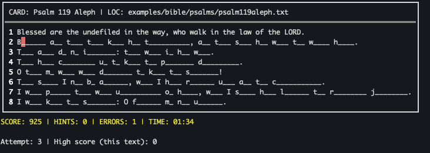

# go-mem

**go-mem** is a terminal-based memory typing game designed to help you memorize texts by typing them out. It masks the text and reveals characters as you type them correctly, reinforcing memory through active recall.

It supports various game modes, timers, batch processing of multiple files, and score tracking.



## Features

*   **Memory Reinforcement**: Type hidden text to reveal it.
*   **Game Modes**:
    *   **First Letter**: Reveal the first letter of every word (`-fl`).
    *   **Random Letters**: Reveal N random letters (`-nr=N`).
    *   **Random Words**: Reveal N random words (`-nfw=N`).
*   **Batch Mode**: Play through multiple files or cards sequentially or randomly (`-rc`).
*   **Timers**: Set a global session timer or let it auto-calculate based on text length.
*   **Scoring**: Track your accuracy, hints used, and speed. High scores are saved locally.
*   **Type Through**: Smart input handling allows you to "type through" revealed hints without penalty.

## Installation

### Quick Install (Recommended)

For automatic download and installation of the latest version:

```bash
curl -fsSL https://raw.githubusercontent.com/ArkieCoder/go-mem/master/install.sh | bash
```

This installs `go-mem` to `/usr/local/bin/go-mem` (requires `sudo` for system-wide installation). The script verifies checksums and handles platform detection.

**Custom Install Path:**
```bash
./install.sh latest /usr/local/bin/go-mem  # or any path
```

**Specific Version:**
```bash
./install.sh v1.0.0
```

**Requirements:** `curl`, `tar`, `jq`, `sha256sum`/`shasum`.

### From Source (Go Developers)

If you have Go installed:

```bash
go install github.com/ArkieCoder/go-mem@latest
```

### Pre-built Binaries

Download the latest binary for your platform (Windows, macOS, Linux) from the [Releases](https://github.com/ArkieCoder/go-mem/releases) page.

## Usage

```bash
go-mem [flags] <file-or-directory>...
```

### Examples

**Basic Play:**
Play with default settings (auto-timer, no hints).
```bash
go-mem examples/lorem.txt
```

**First Letter Mode (Great for memorization):**
Reveal the first letter of every word.
```bash
go-mem -fl examples/bible/psalms/psalm23.txt
```

**Batch Mode (Directory):**
Load all files in a directory and play them in random order with a 5-minute global timer.
```bash
go-mem -rc -t=5:00 examples/bible/psalms
```

**No Timer:**
Disable the timer for a relaxed session.
```bash
go-mem -nt examples/poetry/if-ByRudyardKipling.txt
```

**Random Hints:**
Reveal 5 random words to get you started.
```bash
go-mem -nfw=5 examples/lorem.txt
```

### Command Line Flags

| Flag | Description |
| :--- | :--- |
| `-t, --timer [=TIME]` | Set countdown timer (e.g. `60`, `2:30`). Default is **auto** (~0.33s/char). |
| `-nt, --notimer` | Disable the timer. |
| `-fl, --first-letter` | Reveal the first letter of each word. |
| `-nr, --n-random=N` | Reveal `N` random letters. |
| `-nfw, --n-words=N` | Reveal `N` random words. |
| `-rc, --random-cards` | Randomize card order (Batch Mode only). |
| `-h, --help` | Show help message. |

## File Formats

**go-mem** accepts plain text files. 

### Multiple Cards in One File
You can define multiple "cards" in a single file by separating them with a line containing three or more dashes (`---`).

**Example `quotes.txt`:**
```text
To be, or not to be, that is the question.
---
All the world's a stage,
And all the men and women merely players.
---
The only thing we have to fear is fear itself.
```

## Controls

*   **Type keys**: Type the hidden text.
*   **`?`**: Hint (reveals next character, costs points).
*   **`Ctrl+R`**: Reveal current card (Game Over for that card).
*   **`Ctrl+C`**: Quit.

## Scoring

*   **+25** per correct character.
*   **+250** per completed word.
*   **+1000** per completed card.
*   **+10/sec** time bonus (if timer enabled).
*   **-50** per error.
*   **-100** per hint.

High scores are saved in `~/.config/go-mem/scores.json`.

## Built With

*   [Go](https://go.dev/) 
*   [Bubble Tea](https://github.com/charmbracelet/bubbletea) - TUI framework
*   [Bubbles](https://github.com/charmbracelet/bubbles) - TUI components
*   [Lip Gloss](https://github.com/charmbracelet/lipgloss) - Style definitions for terminal layouts
*   [looplab/fsm](https://github.com/looplab/fsm) - Finite State Machine to manage state

## License

GPLv3
